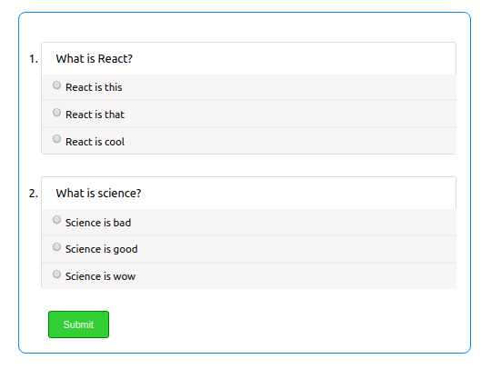
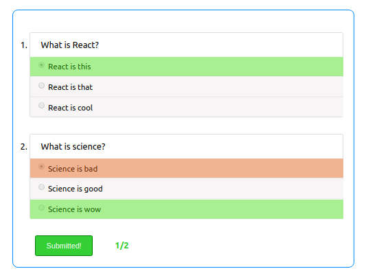

# question-form

React component for adding exercise questions to webpages or blogs.

[](https://www.npmjs.com/package/question-form) [](https://standardjs.com)

## Install

```bash
npm install --save question-form
```

## Usage

### Props

- `questions` (**required**): of type Array. The required format of the questions array is shown below.
- `color` (*optional -> default - '`#ddd`'*): of type String used on for the borders of the question container.

### Required format of questions

Every question should be in form of objects with three keys: name (`string`), options (`array`) and answer (`number`) which is the index of the answer in the options array.

### Example

```jsx
import React, { Component } from 'react'

import QuestionForm from 'question-form'
import 'question-form/dist/index.css'

const Page = () => {
    const questions = [
    {
        name: 'What is React?',
        options: [
            "React is this",
            "React is that",
            "React is cool"
        ],
        answer: 0
    },
    {
        name: 'What is science?',
        options: [
            "Science is bad",
            "Science is good",
            "Science is wow"
        ],
        answer: 2
    },
]

    return (
        <QuestionForm questions={questions} color='rgb(0, 140, 255)'>
    )
}
```
        <QuestionForm questions={questions} color='rgb(0, 140, 255)'>
    )
}
Result:



Result:



And on selection:



`answer: 0` signifies the first option in the first question is correct and `answer: 2` signifies the last option in the second question is correct.

### Use case - markdown blog posts

This component can be used in any framework that allows querying of markdown posts. The questions array would be added to the frontmatter of the markdown, and on querying, this component can be used with the questions property of the frontmatter assigned to the `questions` prop.

This example uses a [Gatsby](https://www.gatsbyjs.org/) Blog.

In the post markdown file:

```md
---
title: "Post title"
questions:
    [
        {
            name: "What is React?",
            options: ["React is this", "React is that", "React is cool"],
            answer: 0,
        },
        ...,
    ]
---

...
```

Wherever you query your post, you could add the following: (the query used here is as shown in [gatsby-starter-blog](https://www.gatsbyjs.org/starters/gatsbyjs/gatsby-starter-blog/))

```jsx
import React from 'react'
import QuestionForm from 'question-form'
---
export default ({data}) => {
    const {frontmatter: {title, questions}} = data.markdownRemark;
    return (
        <div>
            <h1>{title}</h1>
            // some stuffs here
            <h2>Exercise questions</h2>
            <QuestionForm questions={questions}>
        </div>
    )
}
---
export const query = graphql`
  query($slug: String!) {
    markdownRemark(fields: { slug: { eq: $slug } }) {
      fields {
        slug
      }
      frontmatter {
        title
        questions {
            name
            options
            answer
        }
      }
    }
  }
`

```

*You can check a practical example on my blog [in this post](https://dillionmegida.com/p/understanding-the-prototype-chain-in-javascript/). You'll find it at the bottom of the post*

## Issues and Contributions

Your contribution to this project would be highly appreciated. It could be a documentation issue, pull request, feature request, they are all welcome.

-   [Create a pull request](https://github.com/dillionmegida/question-form/pulls)
-   [Open an issue](https://github.com/dillionmegida/question-form/issues)

<!-- ## Users

- [My personal blog](https://dillionmegida.com)
- [TheWebFor5](https://thewebfor5.com) -->

## License

MIT © [dillionmegida](https://github.com/dillionmegida)
